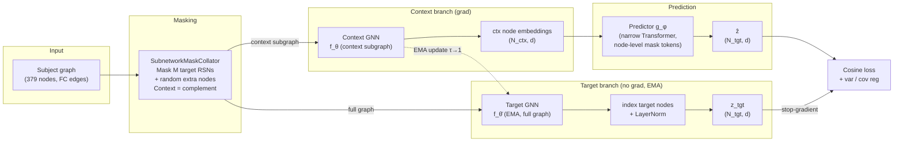

# Brain Subnetwork JEPA

**Self-supervised learning on resting-state fMRI via subnetwork prediction in embedding space.**


---

## Overview / Motivation

Large-scale resting-state fMRI studies consistently reveal that the brain's functional architecture
is not monolithic but organised into a small set of canonical resting-state networks (RSNs) — spatially
coherent subsets of regions whose BOLD signals covary at rest. These networks (visual, somatomotor,
default-mode, frontoparietal, etc.) are replicable across individuals and are known to re-organise in
ageing, psychiatric disorders, and cognitive states.

**Brain Subnetwork JEPA (BS-JEPA)** adapts the Joint-Embedding Predictive Architecture of
[Assran et al., CVPR 2023 (I-JEPA)](https://arxiv.org/abs/2301.08243) to operate on parcellated
fMRI data. The core self-supervised objective is: *given graph-encoded representations of the visible
regions, predict the node-level representations of the held-out regions entirely in embedding space —
without reconstruction of raw signals*. Masking is structured at the level of canonical subnetworks:
each iteration holds out one (or more) of the twelve RSNs, plus a random fraction of the remaining
regions. This forces the model to learn rich, semantic representations of inter-network functional
structure, much as I-JEPA's spatial prediction forces learning of semantic image content rather than
pixel-level textures.

---

## Method — From I-JEPA to BS-JEPA

### Conceptual Mapping

| I-JEPA component | BS-JEPA component |
|---|---|
| Image | Brain (region-level fMRI features) |
| Image patches | Glasser parcels ($N = 379$ regions) |
| Spatially grouped patches | Regions grouped into $K = 12$ RSNs |
| Context block (one large spatial block) | Visible regions (complement of the masked set) |
| $M$ target blocks | Held-out target regions: $M$ whole RSNs (default $M=1$) plus a random fraction of the rest |
| Context encoder (ViT) | **Context encoder: GNN** over the induced subgraph on visible regions |
| Target encoder (ViT, EMA) | **Target encoder: GNN (EMA copy)** over the **full graph**; target-node outputs are indexed |
| Predictor (narrow ViT + positional mask tokens) | **Predictor: narrow Transformer** with one mask token per target *node*, tagged by RSN- and region-identity embeddings |
| L2 loss in representation space | **Cosine** prediction loss + variance/covariance regularisation |

### Architecture Diagram



### Key design invariants

- **The target encoder runs on the full graph**, and target representations are obtained by indexing
  the held-out nodes from its output. This lets target representations capture inter-network context,
  matching I-JEPA (where the target encoder sees the whole image).
- **The target encoder is an EMA copy** of the context encoder; it is never updated by backpropagation.
  Target node embeddings are LayerNorm-ed and stop-gradient before the loss.
- **Predictions are node-level, not pooled.** The predictor emits one embedding per target node;
  there is no subnetwork pooling in the JEPA path.
- **Mask tokens are made unique per node** by adding both an RSN-identity and a region-identity
  embedding (the identity embeddings are detached on the target side to prevent the predictor from
  encoding answers into them). Without per-node identities all queries within an RSN are identical and
  the task degenerates.
- **The loss lives in representation space** — cosine distance, not L2 — augmented with VICReg-style
  variance and covariance regularisation on the context encoder to prevent representational collapse.
- The **predictor is intentionally narrower** (default $d_\text{pred} = 384$) than the encoders.
- **No hand-crafted data augmentations** during pretraining.

---

## Mathematical Formulation

Let $\mathcal{S} = \{1, \dots, K\}$ be the set of all $K = 12$ subnetworks, with a fixed
region-to-subnetwork mapping $\rho : \{1, \dots, N\} \to \mathcal{S}$ loaded from
`data/atlas/glasser379_to_rsn12.csv`.

At each iteration, sample $M$ target subnetworks uniformly and (optionally) an extra random fraction
$r$ of the remaining nodes, giving a target node set $\mathcal{T}_\text{nodes}$ and its complement,
the context node set $\mathcal{C}_\text{nodes}$.

**Encoders** $f_\theta$ (context), $f_{\bar\theta}$ (target, EMA) — GNNs producing node embeddings.
The context encoder runs on the induced subgraph of the visible nodes; the target encoder runs on the
**full graph**, and target rows are then indexed:

$$
H^{\mathcal{C}} = f_\theta\!\left(X^{\mathcal{C}}, E^{\mathcal{C}}\right) \in \mathbb{R}^{|\mathcal{C}_\text{nodes}| \times d},
\qquad
H^{\mathcal{T}} = \Big[\, f_{\bar\theta}\!\left(X, E\right) \,\Big]_{\mathcal{T}_\text{nodes}} \in \mathbb{R}^{|\mathcal{T}_\text{nodes}| \times d}.
$$

**Predictor** $g_\phi$ — narrow Transformer. Input: context node embeddings, each projected and summed
with its RSN-identity embedding $\mathbf{e}^{\text{rsn}}_{\rho(j)}$ and region-identity embedding
$\mathbf{e}^{\text{reg}}_{j}$; plus one mask token $\mathbf{m}$ per target node, summed with the
(detached) RSN- and region-identity embeddings of that node. Output: predicted node embeddings
$\hat{\mathbf{z}}_j$ for $j \in \mathcal{T}_\text{nodes}$.

**Loss.** Cosine prediction loss (stop-gradient and LayerNorm on targets) plus regularisers:

$$
\mathcal{L}_\text{sim} = \frac{1}{|\mathcal{T}_\text{nodes}|}\sum_{j \in \mathcal{T}_\text{nodes}}
\left(2 - 2\, \frac{\hat{\mathbf{z}}_j}{\lVert\hat{\mathbf{z}}_j\rVert} \cdot
\frac{\mathrm{sg}(\mathbf{z}^{\bar\theta}_j)}{\lVert\mathbf{z}^{\bar\theta}_j\rVert}\right),
$$

$$
\mathcal{L} = \mathcal{L}_\text{sim}
+ \lambda_\text{var}\,\mathcal{L}_\text{var}(\hat{\mathbf z})
+ \lambda_\text{ctxvar}\,\mathcal{L}_\text{var}(H^{\mathcal C})
+ \lambda_\text{cov}\,\mathcal{L}_\text{cov}(H^{\mathcal C}),
$$

where $\mathcal{L}_\text{var}(Z) = \frac{1}{d}\sum_i \max(0, \gamma - \mathrm{std}(Z_{\cdot,i}))$ is the
hinge variance term (floor $\gamma$) and $\mathcal{L}_\text{cov}$ is the squared off-diagonal
covariance, normalised by $d$ (VICReg).

**EMA update** (linear momentum schedule $\tau : 0.99 \to 1.0$):

$$
\bar\theta \;\leftarrow\; \tau \,\bar\theta \;+\; (1 - \tau)\,\theta.
$$

---

## Installation

```bash
git clone <repo-url> brain-subnetwork-jepa
cd brain-subnetwork-jepa
pip install -e ".[dev]"
```

> **PyTorch Geometric (PyG) note**: PyG requires matching torch + CUDA wheels. Install them
> separately following the [PyG installation guide](https://pytorch-geometric.readthedocs.io/en/latest/install/installation.html)
> before running `pip install -e .`.

---

## Data Preparation

Two dataset loaders are supported. The primary path (used by `configs/pretrain/default.yaml`) is a
single dictionary file; per-subject files are also supported.

### Option A — single dictionary file (`FCDictDataset`, recommended)

One `.pt`/`.pkl` file mapping subject IDs to per-subject dicts:

```python
{
    "sub-001": {"BOLD": <(N, T) array>, "FC": <(N, N) array>, "age": 27.0, "gender": "M"},
    "sub-002": {...},
    ...
}
```

Set `data.dict_file` in the config. `BOLD`/`FC` key names and BOLD orientation are configurable
(`data.bold_key`, `data.fc_key`, `data.transpose_bold`). `age`/`gender` are optional and, when present,
drive the linear-probe evaluation.

### Option B — one file per subject (`BrainDataset`)

Place `.npz`/`.pt` files in a directory and set `data.subject_dir`. Each file must contain at least one of:

| Key | Shape | Description |
|---|---|---|
| `time_series` | $(N, T)$ | Region-level BOLD time series (FC computed via Pearson) |
| `X` | $(N, T)$ | Time-series matrix as node features (optional `fc_matrix` $(N,N)$ to override FC) |
| `metadata` | dict | Optional, e.g. `{"subject_id": "HCP_100307"}` |

### Node features

`data.node_feature_type` selects what each node carries:

- `bold` — z-scored BOLD time series, reduced to $(N, F)$ by a trainable feature module (`passthrough`
  or `conv1d`) **inside the model**.
- `fc_row` — each node's row of the FC matrix, $(N, N)$.
- `ones` — constant $(N, 1)$; a graph-structure-only baseline/ablation.

### Atlas CSV schema

`data/atlas/glasser379_to_rsn12.csv` maps each region to its RSN (379 regions, 12 RSNs). A
pre-populated file is included in the repository.

---

## Quickstart

### 1. Pretrain on synthetic data (no real data required)

```bash
python scripts/pretrain.py \
    --config configs/pretrain/default.yaml \
    --override data.synthetic=true \
    --override data.num_synthetic_subjects=64 \
    --override data.atlas_csv=data/atlas/glasser379_to_rsn12.csv \
    --override training.num_epochs=5 \
    --override probe.freq=0
```

### 2. Pretrain on real data

```bash
python scripts/pretrain.py --config configs/pretrain/gcn_base.yaml
# or
python scripts/pretrain.py --config configs/pretrain/graph_transformer_base.yaml
```

During pretraining, a set of subjects is **held out** from the training loader and used for periodic
linear-probe evaluation (age regression + gender classification), so probe metrics reflect
generalisation. Loss, EMA-$\tau$, and probe curves are written to `logging.plot_dir`.

### 3. Standalone linear probe on a checkpoint

```bash
python scripts/linear_probe.py \
    --config configs/eval/linear_probe.yaml \
    --override model.checkpoint=outputs/pretrain/ckpt_epoch0100.pt
```

---

## Monitoring training

The per-iteration log reports the diagnostics that distinguish genuine learning from collapse:

- `sim` — cosine prediction loss (the quantity actually being optimised).
- `tgt_std` — mean per-dimension std of target embeddings. **The key health metric**: if it sits at the
  `var_gamma` floor, representations are barely dispersed and the low loss is meaningless; it should
  rise well above the floor as the encoder learns.
- `ctx_var` / `ctx_cov` — context-encoder variance and covariance regularisers (anti-collapse).
- `hat_var` — predictor-output variance regulariser.

The decisive signal is the held-out **probe**: age R² above 0 and gender accuracy above the printed
majority baseline mean the representations carry subject-level information.

---

## Configuration

Key knobs in `configs/pretrain/default.yaml`:

| Parameter | Default | Description |
|---|---|---|
| `model.encoder_type` | `gcn` | `gcn` or `graph_transformer` |
| `model.encoder_out` | `512` | Encoder output dimension $d$ |
| `model.encoder_layers` | `4` | GNN depth |
| `model.predictor_dim` | `384` | Predictor internal width |
| `model.predictor_depth` | `6` | Predictor Transformer layers |
| `data.node_feature_type` | `bold` | `bold`, `fc_row`, or `ones` |
| `data.feature_mode` | `conv1d` | BOLD→feature reducer: `passthrough` or `conv1d` |
| `masking.num_targets` | `1` | $M$ — number of held-out subnetworks |
| `masking.extra_target_ratio` | `0.15` | Fraction of remaining nodes also masked (task variety) |
| `data.fc_strategy` | `top_k` | `dense`, `top_k`, `absolute_threshold`, `fisher_z_then_threshold` |
| `data.top_k` | `10` | Edges per node (for `top_k` strategy) |
| `training.ema_tau_start` | `0.99` | Initial EMA momentum |
| `training.ema_tau_end` | `1.0` | Final EMA momentum |
| `training.lr` | `1e-3` | Peak learning rate |
| `training.var_weight` | `0.5` | Predictor-output variance weight |
| `training.ctx_var_weight` | `1.0` | Context-encoder variance weight (key anti-collapse signal) |
| `training.cov_weight` | `0.1` | Context-encoder covariance weight (VICReg) |
| `training.var_gamma` | `0.25` | Target std floor for the variance terms |

---

## Repository Structure

```
brain-subnetwork-jepa/
├── configs/
│   ├── pretrain/
│   │   ├── default.yaml
│   │   ├── gcn_base.yaml
│   │   └── graph_transformer_base.yaml
│   ├── data/glasser379.yaml
│   └── eval/linear_probe.yaml
├── data/
│   └── atlas/glasser379_to_rsn12.csv
├── src/brain_jepa/
│   ├── data/
│   │   ├── atlas.py          # AtlasMapping loader
│   │   ├── connectivity.py   # FC → PyG graph
│   │   ├── dataset.py        # BrainDataset, FCDictDataset, SyntheticBrainDataset
│   │   └── transforms.py     # BOLD feature modules (passthrough / conv1d)
│   ├── models/
│   │   ├── encoders/
│   │   │   ├── gcn.py               # GCNConv encoder (self-loops, LayerNorm)
│   │   │   └── graph_transformer.py # GPS-style encoder (per-graph global attention)
│   │   ├── pooling.py        # Mean / attention pooling (used by probes/utilities)
│   │   ├── predictor.py      # Narrow Transformer predictor (batched, node-level)
│   │   └── bs_jepa.py        # Top-level BSJEPA module + factory
│   ├── masking/
│   │   └── subnetwork_masking.py  # SubnetworkMaskCollator + extract_subgraph
│   ├── training/
│   │   ├── ema.py            # EMA target-encoder updater
│   │   ├── losses.py         # Cosine JEPA loss + variance/covariance reg
│   │   ├── optim.py          # AdamW + LR/WD schedules
│   │   └── trainer.py        # Pretraining loop
│   ├── evaluation/
│   │   └── linear_probe.py   # Feature extraction + sklearn cross-validated probes
│   └── utils/
│       ├── config.py         # OmegaConf loader
│       ├── logging.py        # Setup + W&B wrapper
│       └── seed.py           # set_seed utility
├── scripts/
│   ├── prepare_data.py
│   ├── pretrain.py
│   └── linear_probe.py
└── tests/
    ├── test_masking.py
    ├── test_dataset.py
    └── test_model.py
```

---

## Citation

```bibtex
@inproceedings{assran2023ijepa,
  title     = {Self-Supervised Learning from Images with a Joint-Embedding Predictive Architecture},
  author    = {Assran, Mahmoud and Duval, Quentin and Misra, Ishan and Bojanowski, Piotr
               and Vincent, Pascal and Rabbat, Michael and LeCun, Yann and Ballas, Nicolas},
  booktitle = {Proceedings of the IEEE/CVF Conference on Computer Vision and Pattern Recognition (CVPR)},
  year      = {2023},
}

@software{bsjepa2024,
  title   = {Brain Subnetwork JEPA: Self-Supervised Learning on Resting-State fMRI},
  author  = {Vannoni, Stefano},
  year    = {2024},
  url     = {https://github.com/stefanovannoni/brain-subnetwork-jepa},
  license = {MIT},
}
```

---

## Acknowledgments

This project adapts the architecture and training conventions from Meta FAIR's
[facebookresearch/jepa](https://github.com/facebookresearch/jepa) repository.
We thank the I-JEPA authors for releasing their code and model weights under an open licence.

---

## License

MIT — see [LICENSE](LICENSE).
