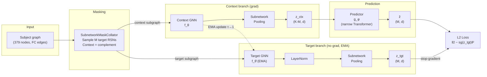

# Brain Subnetwork JEPA

**Self-supervised learning on resting-state fMRI via subnetwork prediction in embedding space.**


---

## Overview / Motivation

Large-scale resting-state fMRI studies consistently reveal that the brain's functional architecture
is not monolithic but organised into a small set of canonical resting-state networks (RSNs) — spatially
coherent subsets of regions whose BOLD signals covary at rest. These networks (visual, somatomotor,
default-mode, frontoparietal, etc.) are replicable across individuals and are known to re-organise in
ageing, psychiatric disorders, and cognitive states.

**Brain Subnetwork JEPA (BS-JEPA)** adapts the Joint-Embedding Predictive Architecture of
[Assran et al., CVPR 2023 (I-JEPA)](https://arxiv.org/abs/2301.08243) to operate on parcellated
fMRI data. The core self-supervised objective is: *given graph-encoded representations of eleven of
the twelve canonical RSNs, predict the representation of the held-out twelfth subnetwork entirely in
embedding space — without reconstruction of raw signals*. This forces the model to learn rich,
semantic representations of inter-network functional structure, much as I-JEPA's spatial prediction
forces learning of semantic image content rather than pixel-level textures.

---

## Method — From I-JEPA to BS-JEPA

### Conceptual Mapping

| I-JEPA component | BS-JEPA component |
|---|---|
| Image | Brain (region-level fMRI features) |
| Image patches | Glasser parcels ($N = 379$ regions) |
| Spatially grouped patches | Regions grouped into $K = 12$ RSNs |
| Context block (one large spatial block) | Visible subnetworks ($K - M$ of them) |
| $M$ target blocks | $M$ held-out target subnetworks (default $M=1$) |
| Context encoder (ViT) | **Context encoder: GNN** over the induced subgraph on visible regions |
| Target encoder (ViT, EMA) | **Target encoder: GNN (EMA copy)** over the induced subgraph on target regions |
| Predictor (narrow ViT + positional mask tokens) | **Predictor: narrow Transformer** conditioned on subnetwork-identity tokens |
| L2 loss in representation space | L2 loss in representation space |

### Architecture Diagram



### Key design invariants (from I-JEPA)

- **Targets are masked at the target encoder's output**, not at its input — the target encoder sees its
  full target subgraph.
- **The target encoder is an EMA copy** of the context encoder; it is never updated by backpropagation.
- **Loss is computed entirely in representation space** (L2), never in input or feature space.
- The **predictor is intentionally narrower** (default $d_\text{pred} = 384$) than the encoders.
- **No hand-crafted data augmentations** during pretraining.

---

## Mathematical Formulation

Let $\mathcal{S} = \{1, \dots, K\}$ be the set of all $K = 12$ subnetworks, with a fixed
region-to-subnetwork mapping $\rho : \{1, \dots, N\} \to \mathcal{S}$ loaded from
`data/atlas/glasser379_to_rsn12.csv`.

At each iteration, sample $M$ target subnetworks uniformly:

$$
\mathcal{T} \subset \mathcal{S}, \quad |\mathcal{T}| = M, \qquad
\mathcal{C} = \mathcal{S} \setminus \mathcal{T}.
$$

**Encoders** $f_\theta$ (context), $f_{\bar\theta}$ (target, EMA) — GNNs producing node embeddings:

$$
H^{\mathcal{C}} = f_\theta\!\left(X^{\mathcal{C}}, E^{\mathcal{C}}\right) \in \mathbb{R}^{|\mathcal{C}\text{ nodes}| \times d},
\qquad
H^{\mathcal{T}} = f_{\bar\theta}\!\left(X^{\mathcal{T}}, E^{\mathcal{T}}\right) \in \mathbb{R}^{|\mathcal{T}\text{ nodes}| \times d}.
$$

**Subnetwork pooling** aggregates node embeddings per RSN:

$$
\mathbf{z}_k = \mathrm{Pool}\!\left(\{H_j : \rho(j) = k\}\right), \quad k \in \mathcal{S}.
$$

**Predictor** $g_\phi$ — narrow Transformer. Input: context tokens $\{\mathbf{z}_k : k \in \mathcal{C}\}$
each summed with learned identity embedding $\mathbf{e}_k$, plus a shared mask token $\mathbf{m}$
summed with $\mathbf{e}_{k^*}$ for each target $k^* \in \mathcal{T}$. Output: predicted tokens $\hat{\mathbf{z}}_{k^*}$.

**Loss** (L2 in representation space, stop-gradient on target):

$$
\mathcal{L}(\theta, \phi) \;=\; \frac{1}{M} \sum_{k^* \in \mathcal{T}}
\bigl\lVert \hat{\mathbf{z}}_{k^*} - \mathrm{sg}\!\left(\mathbf{z}^{\bar\theta}_{k^*}\right) \bigr\rVert_2^2.
$$

**EMA update** (linear momentum schedule $\tau : 0.996 \to 1.0$):

$$
\bar\theta \;\leftarrow\; \tau \,\bar\theta \;+\; (1 - \tau)\,\theta.
$$

---

## Installation

```bash
git clone <repo-url> brain-subnetwork-jepa
cd brain-subnetwork-jepa
pip install -e ".[dev]"
```

> **PyTorch Geometric (PyG) note**: PyG requires matching torch + CUDA wheels. Install them
> separately following the [PyG installation guide](https://pytorch-geometric.readthedocs.io/en/latest/install/installation.html)
> before running `pip install -e .`.

---

## Data Preparation

### Expected input format

Place one file per subject in `data/subjects/`. Each file must be `.npz` or `.pt` and contain
**at least one** of:

| Key | Shape | Description |
|---|---|---|
| `X` | $(379, F)$ | Pre-computed node features |
| `time_series` | $(379, T)$ | Region-level BOLD time series |
| `metadata` | dict | Optional, e.g. `{"subject_id": "HCP_100307"}` |

When only `time_series` is present, a configurable feature module (passthrough / conv1d / transformer)
reduces it to $(379, F)$ before graph construction.

### Atlas CSV schema

`data/atlas/glasser379_to_rsn12.csv` — four columns:

| Column | Type | Description |
|---|---|---|
| `region_id` | int | 1-indexed Glasser region identifier |
| `region_name` | str | Human-readable region name |
| `rsn_id` | int | 1-indexed RSN assignment |
| `rsn_name` | str | RSN name (e.g. "Default", "Visual") |

A pre-populated file covering 379 regions and 12 RSNs is included in the repository.

---

## Quickstart

### 1. Prepare real data (adapt to your format)

```bash
python scripts/prepare_data.py \
    --input_dir /path/to/raw/fmri \
    --output_dir data/subjects \
    --atlas_csv data/atlas/glasser379_to_rsn12.csv
```

### 2. Pretrain on synthetic data (no real data required)

```bash
python scripts/pretrain.py \
    --config configs/pretrain/default.yaml \
    --override data.synthetic=true \
    --override data.num_synthetic_subjects=64 \
    --override training.num_epochs=5
```

### 3. Pretrain on real data

```bash
python scripts/pretrain.py --config configs/pretrain/gcn_base.yaml
# or
python scripts/pretrain.py --config configs/pretrain/graph_transformer_base.yaml
```

### 4. Linear probe evaluation

```bash
python scripts/linear_probe.py \
    --config configs/eval/linear_probe.yaml \
    --override model.checkpoint=outputs/pretrain/ckpt_epoch0100.pt \
    --override probe.num_classes=2
```

---

## Configuration

Key knobs in `configs/pretrain/default.yaml`:

| Parameter | Default | Description |
|---|---|---|
| `model.encoder_type` | `gcn` | `gcn` or `graph_transformer` |
| `model.encoder_out` | `512` | Encoder output dimension $d$ |
| `model.encoder_layers` | `4` | GNN depth |
| `model.pooling_mode` | `mean` | `mean` or `attention` |
| `model.predictor_dim` | `384` | Predictor internal width |
| `model.predictor_depth` | `6` | Predictor Transformer layers |
| `masking.num_targets` | `1` | $M$ — number of held-out subnetworks |
| `masking.include_cross_edges` | `false` | Include cross-subnetwork edges in context |
| `data.fc_strategy` | `top_k` | FC graph strategy: `dense`, `top_k`, `absolute_threshold`, `fisher_z_then_threshold` |
| `data.top_k` | `10` | Edges per node (for `top_k` strategy) |
| `training.ema_tau_start` | `0.996` | Initial EMA momentum |
| `training.ema_tau_end` | `1.0` | Final EMA momentum |
| `training.lr` | `1e-3` | Peak learning rate |
| `training.weight_decay_start` | `0.04` | Initial weight decay |
| `training.weight_decay_end` | `0.4` | Final weight decay |

---

## Repository Structure

```
brain-subnetwork-jepa/
├── configs/
│   ├── pretrain/
│   │   ├── default.yaml
│   │   ├── gcn_base.yaml
│   │   └── graph_transformer_base.yaml
│   ├── data/glasser379.yaml
│   └── eval/linear_probe.yaml
├── data/
│   └── atlas/glasser379_to_rsn12.csv
├── src/brain_jepa/
│   ├── data/
│   │   ├── atlas.py          # AtlasMapping loader
│   │   ├── connectivity.py   # FC → PyG graph
│   │   ├── dataset.py        # BrainDataset, SyntheticBrainDataset
│   │   └── transforms.py     # Time-series feature modules
│   ├── models/
│   │   ├── encoders/
│   │   │   ├── gcn.py              # GraphSAGE encoder
│   │   │   └── graph_transformer.py # GPS-style encoder
│   │   ├── pooling.py        # Mean / attention subnetwork pooling
│   │   ├── predictor.py      # Narrow Transformer predictor
│   │   └── bs_jepa.py        # Top-level BSJEPA module + factory
│   ├── masking/
│   │   └── subnetwork_masking.py  # SubnetworkMaskCollator
│   ├── training/
│   │   ├── ema.py            # EMA target-encoder updater
│   │   ├── losses.py         # L2 JEPA loss
│   │   ├── optim.py          # AdamW + LR/WD schedules
│   │   └── trainer.py        # Pretraining loop
│   ├── evaluation/
│   │   └── linear_probe.py   # Feature extraction + linear probe
│   └── utils/
│       ├── config.py         # OmegaConf loader
│       ├── logging.py        # Setup + W&B wrapper
│       └── seed.py           # set_seed utility
├── scripts/
│   ├── prepare_data.py
│   ├── pretrain.py
│   └── linear_probe.py
└── tests/
    ├── test_masking.py
    ├── test_dataset.py
    └── test_model.py
```

---

## Citation

```bibtex
@inproceedings{assran2023ijepa,
  title     = {Self-Supervised Learning from Images with a Joint-Embedding Predictive Architecture},
  author    = {Assran, Mahmoud and Duval, Quentin and Misra, Ishan and Bojanowski, Piotr
               and Vincent, Pascal and Rabbat, Michael and LeCun, Yann and Ballas, Nicolas},
  booktitle = {Proceedings of the IEEE/CVF Conference on Computer Vision and Pattern Recognition (CVPR)},
  year      = {2023},
}

@software{bsjepa2024,
  title   = {Brain Subnetwork JEPA: Self-Supervised Learning on Resting-State fMRI},
  author  = {Vannoni, Stefano},
  year    = {2024},
  url     = {https://github.com/stefanovannoni/brain-subnetwork-jepa},
  license = {MIT},
}
```

---

## Acknowledgments

This project adapts the architecture and training conventions from Meta FAIR's
[facebookresearch/jepa](https://github.com/facebookresearch/jepa) repository.
We thank the I-JEPA authors for releasing their code and model weights under an open licence.

---

## License

MIT — see [LICENSE](LICENSE).
